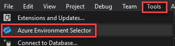
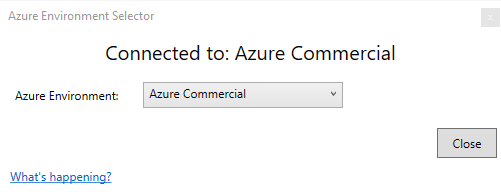
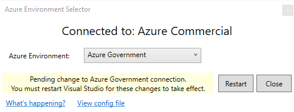

# Azure Environment Selector

The Azure Environment Selector is the quickest and easiest way to switch between Azure environments. 
For example, if you are an [Azure Government](https://azure.microsoft.com/en-us/overview/clouds/government/) developer, 
you may need to regularly switch between Azure Government and regular Azure commercial (same is
true for Azure Germany or Azure China). From within Visual Studio, you can connect to Azure Government
with tools such as the `Cloud Explorer`, the Azure node in the `Server Explorer`, the main Visual Studio login, 
and publishing a web app from the `Solution Explorer`.

For Visual Studio 2017, there is a [manual process](https://docs.microsoft.com/en-us/azure/azure-government/documentation-government-get-started-connect-with-vs) **(dead link)**
you can go through to put an Azure Active Directory config file in place that will enable you 
to control which environment Visual Studio connects to. This extension **automates** that manual
process.

## Quick Start

After installing the extension, you will click the `Tools` menus and you will find an
`Azure Environment Selector` item in the menu.

Click the menu item and you will see the Azure Environment Selector dialog:

Use the dropdown to select a different environment such as `Azure Government`:

From here you can restart Visual Studio and the change will take affect. Once Visual Studio
restarts, you will now be able to connect to other environments with VS tools such as 
the Cloud Explorer (shown below connected to Azure Government), Server Explorer, main Visual
Studio login, and Solution Explorer.

